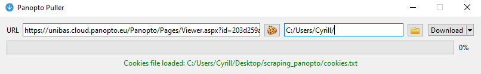

# panopto-puller
A minmalist UI for yt-dlp (youtube-dl) written in PyQt.



# Start local dev environment
- Use a virtual environment, tested with Python=3.10
- pip install -r requirements.txt  

 ```bash 
 # For example with conda:
conda create -y --name pp python=3.11
conda activate pp 
conda install pip
pip install -r requirements.txt
```
